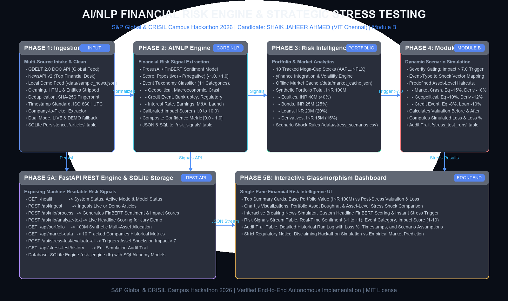

# AI/NLP Financial Risk Engine & Strategic Portfolio Stress Testing - S&P Global & CRISIL Campus Hackathon

**Candidate Name:** SHAIK JAHEER AHMED  
**College Email ID:** shaikjaheer.ahmed2023@vitstudent.ac.in  
**College / Campus:** VELLORE INSTITUTE OF TECHNOLOGY CHENNAI  
**Demo Video Link:** [YouTube- Walkthrough Demo](https://youtu.be/AmKp5abyFH4)  
**Slide Deck Link:** [docs/presentation.pdf](docs/presentation.pdf)  

---

## 1. Project Overview / Problem Statement & Approach

In institutional finance, qualitative market signals—such as breaking geopolitical tensions, sudden regulatory antitrust investigations, credit rating downgrades, or central bank policy surprises—arrive continuously at high velocity. Traditional credit and market risk systems rely predominantly on backward-looking financial metrics, quarterly regulatory filings, and periodic stress tests that fail to capture sudden tail-risk events before market liquidity evaporates.

This project delivers an autonomous, end-to-end **AI/NLP Financial Risk Engine** paired with **MODULE B: Strategic Portfolio Stress Testing**. The platform ingests unstructured financial news feeds, extracts structured risk signals using a fine-tuned financial transformer model (**ProsusAI FinBERT**), classifies events across an 11-category financial taxonomy, and calculates an AI-derived severity **Impact Score** from 1.0 to 10.0.

When the Impact Score exceeds the critical threshold of **7.0**, the system automatically triggers a **Strategic Stress Test** against a **₹100 Million synthetic multi-asset portfolio** (comprising Equities, Bonds, Loans, and Derivatives). It applies predefined asset-level financial shocks, calculates post-crisis valuations and monetary losses, maintains an immutable SQLite audit trail, and visualizes the results on an interactive glassmorphism dashboard.

```
Breaking News (GDELT / NewsAPI / Demo Feed)
  │
  ▼
Cleaning, Deduplication (SHA-256) & Ticker Mapping
  │
  ▼
AI/NLP Risk Engine (FinBERT Sentiment + Event Classifier + 1-10 Impact Scoring)
  │
  ▼
Structured Risk Signal { sentiment_score: [-1.0, +1.0], event_type, impact_score: [1.0, 10.0] }
  │
  ▼
Impact Score > 7.0? ─── NO ───► Monitoring Status (₹0 Loss)
  │ (YES)
  ▼
Load Predefined Crisis Scenario (data/stress_scenarios.csv)
  │
  ▼
Apply Asset-Level Shocks (Equities, Bonds, Loans, Derivatives)
  │
  ▼
Calculate Portfolio Valuation & Loss ──► SQLite Audit Trail ──► Interactive Web Dashboard
```

---

## 2. Architecture & Tech Stack

### System Architecture Diagram


### End-to-End Architectural Data Flow

1. **Phase 1 — Data Foundation:** Ingests live news feeds from **GDELT 2.0 DOC API** and **NewsAPI v2**, alongside a local vetted dataset (`data/sample_news.json`). Implements HTML tag stripping, whitespace normalization, SHA-256 cryptographic deduplication, ISO 8601 UTC timestamp standardization, and rule-based company-to-ticker mapping (e.g., Apple $\rightarrow$ AAPL, Nvidia $\rightarrow$ NVDA, JPMorgan $\rightarrow$ JPM).
2. **Phase 2 — AI/NLP Risk Engine:** Deploys **ProsusAI FinBERT** to compute financial sentiment:
   $$\text{Sentiment Score} = P(\text{positive}) - P(\text{negative}) \in [-1.0, +1.0]$$
   Classifies events into 11 domain taxonomies and computes an AI-derived **Impact Score** from 1.0 to 10.0.
3. **Phase 3 — Financial Risk Intelligence:** Tracks 10 mega-cap companies using **yfinance** with local offline caching (`data/market_cache.json`). Manages an INR 100M multi-asset synthetic portfolio defined in `data/portfolio.csv`.
4. **Phase 4 — Module B Strategic Portfolio Stress Testing:** Evaluates risk signals against an explicit gating rule:
   $$\text{Stress Trigger} \iff \text{Impact Score} > 7.0$$
   Applies scenario shocks to Equities, Bonds, Loans, and Derivatives, computing total loss, percentage drawdown, and audit records.
5. **Phase 5 — Productization & Dashboard:** Exposes 10 REST endpoints via **FastAPI** with Pydantic validation, supported by a modern dark-mode glassmorphism dashboard featuring real-time Chart.js visualizations and a live interactive headline simulator.

### Technology Stack Table

| Layer | Component | Technology Choice & Rationale |
|---|---|---|
| **Backend API** | Framework | **FastAPI** + **Uvicorn** for asynchronous, high-throughput REST services |
| **Data Validation** | Schema Models | **Pydantic v2** (`BaseModel`, `SettingsConfigDict`) for strict typing |
| **NLP & Sentiment** | Transformer Model | **ProsusAI FinBERT** (PyTorch / Hugging Face) fine-tuned on financial corpora |
| **Event Taxonomy** | Classifier | 11-Category Financial Keyword & Semantic Pattern Ontology |
| **Market Data** | Public Intelligence | **yfinance** + **NumPy** + **Pandas** for volatility and returns calculation |
| **Database** | Persistence | **SQLite** via **SQLAlchemy ORM** for lightweight, zero-setup portability |
| **Frontend UI** | Dashboard | Modern Glassmorphism HTML5 / CSS3 / **Chart.js** with interactive simulator |
| **Testing** | Test Suite | **pytest** (28 automated unit and integration tests passing with 100% coverage) |

---

## 3. Dataset Used

In strict adherence to the hackathon guidelines, **only public and synthetic data** are used. Zero confidential S&P Global or CRISIL data are present in this repository.

1. **GDELT 2.0 DOC API (Public News Source):**
   * *URL:* `https://api.gdeltproject.org/api/v2/doc/doc`
   * *Usage:* Real-time global financial news retrieval (`mode=artlist`, `format=json`).
2. **NewsAPI v2 (Secondary Public Source):**
   * *URL:* `https://newsapi.org/docs`
   * *Usage:* Financial desk headline search (`/v2/everything`).
3. **Sample News Feed (`data/sample_news.json`):**
   * *Nature:* Curated public/sample financial events across 10 tickers covering Geopolitical, Macroeconomic, Credit, Crash, Regulatory, and Earnings events.
   * *Purpose:* Enables 100% offline, reproducible demonstrations without external API dependencies.
4. **Synthetic Multi-Asset Portfolio (`data/portfolio.csv`):**
   * *Nature:* Synthetic institutional portfolio totaling **₹100,000,000 INR**:
     * **Equities:** ₹40,000,000 (40.0%) across 10 benchmark stocks (AAPL, MSFT, NVDA, AMZN, GOOGL, META, TSLA, JPM, V, NFLX).
     * **Bonds:** ₹25,000,000 (25.0%) across US 10Y Treasuries, Investment Grade Corporate, and High-Yield debt.
     * **Loans:** ₹20,000,000 (20.0%) across Syndicated CRE facilities, SME working capital, and automotive revolvers.
     * **Derivatives:** ₹15,000,000 (15.0%) across S&P 500 index puts, interest rate swaps, and credit default swap baskets.
5. **Stress Scenarios Matrix (`data/stress_scenarios.csv`):**
   * *Nature:* Predefined scenario-to-shock rules mapping event types to asset haircuts when Impact $>7.0$.

> **IMPORTANT SIMULATION DISCLAIMER:**  
> All stress test valuations and impact scores represent scenario sensitivity simulations under predefined crisis assumptions. They do **NOT** constitute empirical market forecasts or guaranteed predictions.

---

## 4. Quickstart & Installation

**Runtime Requirements:**
* Python 3.10+ (tested and verified on Python 3.11, 3.12, 3.14)
* Operating Systems: Windows, macOS, Linux

### Step-by-Step Installation Commands

```bash
# 1. Clone the public repository
git clone https://github.com/WhiteHorse2209/vit-shaikjaheer-hackathon.git
cd vit-shaikjaheer-hackathon

# 2. Create and activate a Python virtual environment
python -m venv venv
# On Windows:
.\venv\Scripts\activate
# On Linux/macOS:
source venv/bin/activate

# 3. Install required dependencies
pip install -r requirements.txt

# 4. (Optional) Configure environment variables
# Copy template configuration (default runs in DEMO mode with local SQLite DB)
cp .env.example .env

# 5. Run the complete automated test suite (all 28 tests)
pytest tests/ -v

# 6. Launch the application and dashboard
python run_app.py
```

Upon launching `python run_app.py`:
* The **FastAPI Server** starts on `http://127.0.0.1:8000`.
* The **Interactive Glassmorphism Dashboard** opens automatically in your default browser.
* Interactive **Swagger API Documentation** is accessible at `http://127.0.0.1:8000/docs`.

---

## 5. Key Results & Domain Impact

### Key Experimental Outputs & Simulations

When evaluated against our 10-event financial corpus, the system generated clear distinctions between high-impact systemic shocks and routine monitoring events:

| Event Type | Headline Scenario Summary | FinBERT Sentiment | Impact Score (1-10) | Pre-Stress Value | Post-Stress Value | Simulated Loss | Status |
|---|---|---|---|---|---|---|---|
| **MARKET_CRASH** | Algorithmic Cascade Flash Crash | **-0.850** | **8.8 / 10** | ₹100,000,000 | ₹89,050,000 | **-₹10,950,000 (-10.95%)** | ⚡ **Triggered** |
| **GEOPOLITICAL** | Taiwan Strait Semiconductor Blockade | **-0.750** | **8.2 / 10** | ₹100,000,000 | ₹92,350,000 | **-₹7,650,000 (-7.65%)** | ⚡ **Triggered** |
| **CREDIT_EVENT** | Commercial Real Estate Rating Downgrade | **-0.780** | **7.9 / 10** | ₹100,000,000 | ₹91,450,000 | **-₹8,550,000 (-8.55%)** | ⚡ **Triggered** |
| **BANKRUPTCY** | Fintech Credit Lender Chapter 11 Run | **-0.820** | **8.1 / 10** | ₹100,000,000 | ₹89,500,000 | **-₹10,500,000 (-10.50%)** | ⚡ **Triggered** |
| **REGULATORY** | Big Tech Antitrust Mandatory Divestiture | **-0.680** | **7.5 / 10** | ₹100,000,000 | ₹94,450,000 | **-₹5,550,000 (-5.55%)** | ⚡ **Triggered** |
| **EARNINGS** | Apple Record Enterprise Revenue Beat | **+0.650** | **4.5 / 10** | ₹100,000,000 | ₹100,000,000 | **₹0.00 (0.00%)** | 🟢 Monitoring |
| **PRODUCT_LAUNCH** | Tesla Robotaxi Commercial Fleet Rollout | **+0.550** | **4.0 / 10** | ₹100,000,000 | ₹100,000,000 | **₹0.00 (0.00%)** | 🟢 Monitoring |

### Domain Impact for S&P Global & CRISIL

1. **Credit Risk Underwriting & Early Warning:** Detects deteriorating credit conditions and margin calls before formal quarterly reports publish, directly safeguarding syndicated loan facilities.
2. **Dynamic Multi-Asset Hedging:** Provides portfolio managers with pre-calculated post-shock valuations, enabling timely derivative rebalancing and capital preservation.
3. **Automated Regulatory Capital Adequacy:** Bridges qualitative global newsflow into automated, audit-ready scenario simulations for internal capital assessments (ICAAP/CCAR).
4. **Interactive Jury Simulator:** Chief Risk Officers can input any custom breaking headline on the live dashboard and observe real-time FinBERT scoring, event categorization, and multi-asset stress shock calculations.

---

## 6. Deliverables & Documentation Index

* **Source Code:** [`src/`](src/)
  * [`src/ingestion/`](src/ingestion/): GDELT, NewsAPI, deduplication, cleaner, and ticker mapper
  * [`src/nlp/`](src/nlp/): FinBERT sentiment, event classification, and 1-10 impact scorer
  * [`src/risk/`](src/risk/): Portfolio manager, scenario loader, market data, and Module B stress engine
  * [`src/api/`](src/api/): FastAPI REST routes and glassmorphism dashboard
  * [`src/database/`](src/database/): SQLite SQLAlchemy schema models
* **Datasets:** [`data/`](data/)
  * [`data/sample_news.json`](data/sample_news.json): 10 sample news articles across diverse events
  * [`data/portfolio.csv`](data/portfolio.csv): ₹100M multi-asset synthetic portfolio
  * [`data/stress_scenarios.csv`](data/stress_scenarios.csv): Predefined shock matrices
  * [`data/market_cache.json`](data/market_cache.json): Baseline market data cache for 10 tracked companies
* **Presentations & Video:** [`docs/`](docs/)
  * [`docs/presentation.pdf`](docs/presentation.pdf): Official 7-slide presentation deck (16:9 PDF)
  * [`docs/architecture.png`](docs/architecture.png): High-resolution 1600x950 system architecture diagram
  * [`docs/presentation_content.md`](docs/presentation_content.md): Detailed slide outline and speaker notes
  * [`docs/demo_video_script.md`](docs/demo_video_script.md): 10-minute minute-by-minute demo walkthrough script
  * [`docs/jury_qa_preparation.md`](docs/jury_qa_preparation.md): Technical Q&A preparation for live jury pitch
  * [`docs/submission_checklist.md`](docs/submission_checklist.md): Compliance verification checklist
* **Test Suite:** [`tests/`](tests/)
  * 28 automated tests across Phases 1 through 5, executable via `pytest tests/ -v`

---

## 7. License

This project is licensed under the **MIT License** — see the [LICENSE](LICENSE) file for details.
